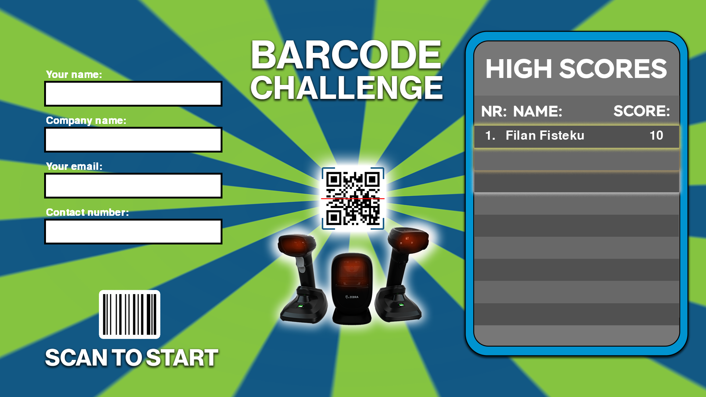
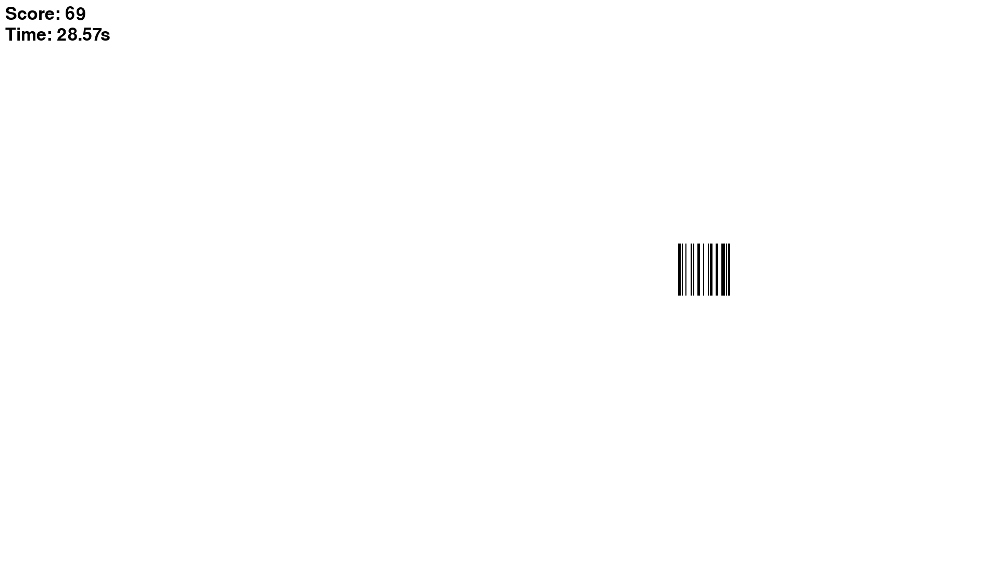
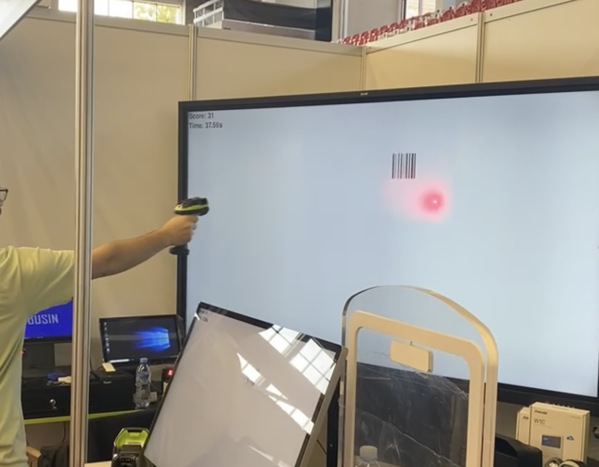

# Barcode Challenge Game

A simple game built in Python (PyGame), and made for an exhibition event (EXPOKOS). To play the game, you must have a Barcode Reader 1D or 2D that also scans barcodes on the screen connected to the PC (like these: https://solvit-ks.com/lexues-te-barkodeve-zebra)

The code is not the best, there are a lot rewritten code that could be written better, but for the deadline and my use, it worked perfectly. I tried to comment the code a little but if you need help, you can contact me 

The game has:
- 3 Levels 
- Top 10 High Score List
- Storage for the players contacts...

## Screenshots

### For the exhibition event:

- I made the game 4K,
- Connected and mirrored the game on a: SMART Board GX 86" (https://www.smarttech.com/en/education/products/interactive-displays/gx-series)
- Connected the Zebra DS3600 Barcode Scanner with the PC (https://www.zebra.com/gb/en/products/scanners/ultra-rugged-scanners/ds3600-series.html)

## How To Play

- Connect a 1D Barcode Scanner with the PC
- First, fill the blank text fields
- The player must stand away from the screen in a preferred distance
- When the player scans the Start Barcode on the bottom left of the Start Screen, the game starts
- There are 3 levels, Level 1 just random barcodes popping on the screen, Level 2 random barcode falling from the top and Level 3 random barcode falling to the left from the top
- The player must scan as many barcodes as possible
- When 60 seconds pass, the game ends and if the player reached Top 10 High Score List, their name will be listed in the Top 10 List
